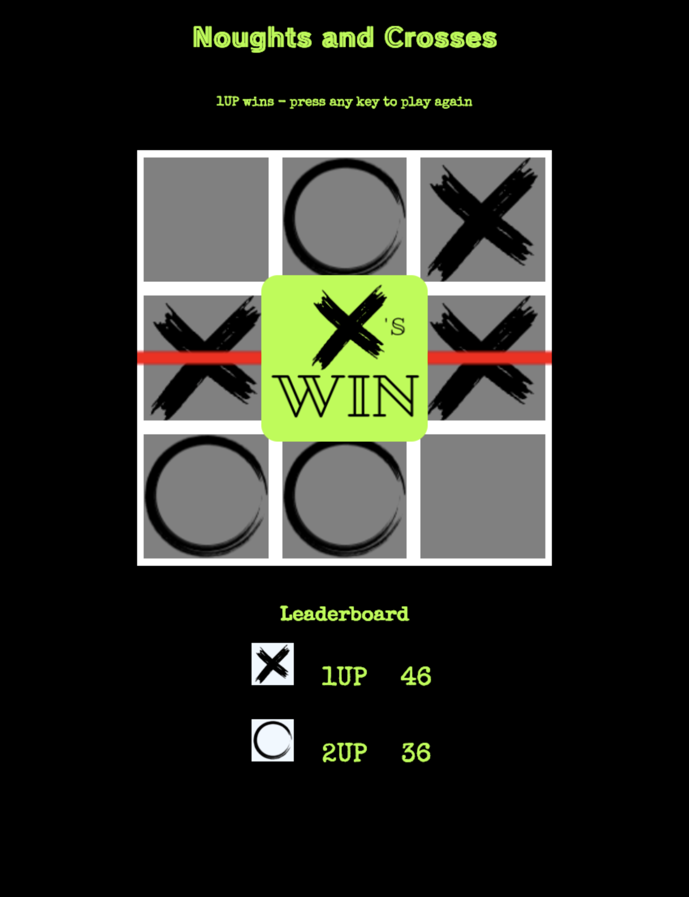
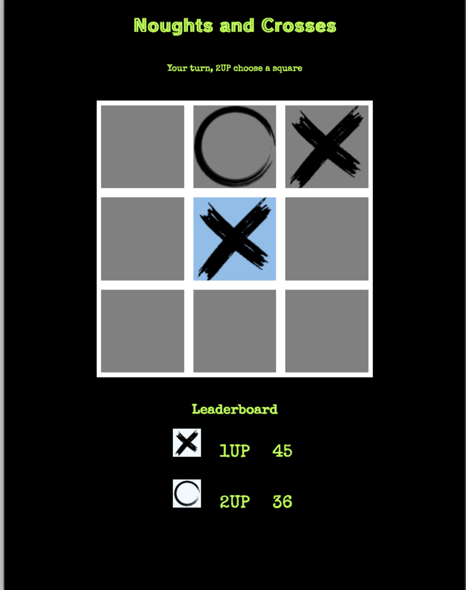

Noughts and Crosses
---
*The classic game to pass the time. Take turn marking boxes until one player has 3 in a row or all boxes are marked. (e.g. a draw)*

## Features
- 2 player turn-based action!
- fun for the whole family (in groups of two)
- wins are tracked between visits to the site
- sunglasses at night dark mode (who needs light mode amirite)

## Approach
UI and the game logic are separate files. Wins are stored in browser localstorage.

## Technology
- HTML - page structure
- CSS - styling
- JS - game logic
- jQuery - dom manipulation, animations
- Canva - visual assets
- Github - version control

## Link to game
[Play Online Now](https://deepabst.github.io/tic-tac-toe/)

## Project Lead
Dee Pabst
deepabst@gmail.com

## Shout outs
Shout out to my SEI55 family  - "Fail Louder!"